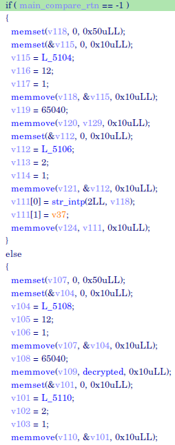
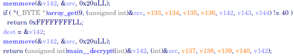

# 4D Number Generator

Vlang Reverse Engineering

## Description (public)

```
PALINDROME has hacked into the 4D lottery system and is now able to predict the winning numbers. They plan to use this information to rig the next draw and win millions of dollars.

Our forensics team managed to find a memory dump from one of the compromised systems, containing their binary executable. Determine how it works in order to stop them and protect the integrity of the 4D lottery system.
```

## Setup Guide

1. Provide `4d` in `dist/` to players
2. Run `make` to generate `docker-compose.yml`
3. Run `docker-compose up -d` to host challenge on `http://<domain>:8888`

## License

This project is distributed under the terms of Apache License 2.0.

See [Apache License 2.0](LICENSE) for details.

Any reference, changes and usage of this project source are to be disclosed and retain this license.

## Solution

Process flow is as follows:

[](https://mermaid.live/edit#pako:eNp1kk9vwiAYh7_KGy5uicbLTj0sUVv_JcuW6GnrUt-WV23WAqFUZ1q_-5DidIdxAp7nB78EGpZJTixg20Iesz1qA-swFmDH6KPEXHzCYPAMYzdPErfT4bEDy2YuKwNHSqEifSB97ujkoTfsPV6UdhatYdhC6I8YKZXkgtO3Pye8STsyyRNPRF2mpFuI7hJ_kE9GrsHUW5ksFWrybOrYzDNOmT4p49ncdgtyoYwv-Pa6spe7nRYWd5fuUfCCkgvw0YULrMjArpApFnBAnWNaEGwUVtXGlu7E2f-iL0P8Zi9d28n9Ys76rCRty3D7Os0FxczsqaSYBXbKUX_FLBZn69WKo6GI50ZqFmyxqKjPsDZydRIZC4yu6SqFOe40lr8WudBL9wfcV-gzheJdyqtz_gFmGa_I)

The `main__App_handle_inpt` function converts the POST url string into bytes and saves the byte array into the global variable `pass`.


This global variable `pass` is referenced in the `main__App_get_4d_number` function and manipulated as shown below. Then, it is passed into the `main__compare` function.


The return value of the `main__compare` function is then checked, and a global variable `decrypted` is used when the return value is not `-1`.



In the `main__compare` function, multiple `array_get` calls are made to a byte array, supposedly the manipulated `pass` byte array passed into the function from before.

If the byte retrieved from the byte array via `array_get` at the specified index fails the if condition, the `main__compare` function will return `-1`. As such, all the `array_get` if conditions have to pass for the function to not return `-1`.


At the end of the `array_get` if conditions in the `main__compare` function, the byte array is passed into the `main__decrypt` function. The return value of the `main__decrypt` function is then returned by the `main__compare` function.



At the end of the `main__decrypt` function, a byte array is converted into a string, and saved into the global variable `decrypted`.

Afterwards, the string is checked if it contains the string `TISC`. If it does, the function returns `0`, else `-1`.


As such, we need to POST a string in the URL which passes all the `array_get` if conditions, and it will decrypt a string that contains `TISC`.

To find what the URL string should be, we can export the `array_get` if conditions and retrieve the byte comparisons. Then, reverse the byte manipulations in the `main__App_get_4d_number` function. [Refer to xpl.py](xpl/xpl.py)

After POSTing this string to the URL, the flag will be shown on the index page.

## Flag

`TISC{Vlang_R3v3rs3_3ng1n333r1ng}`
